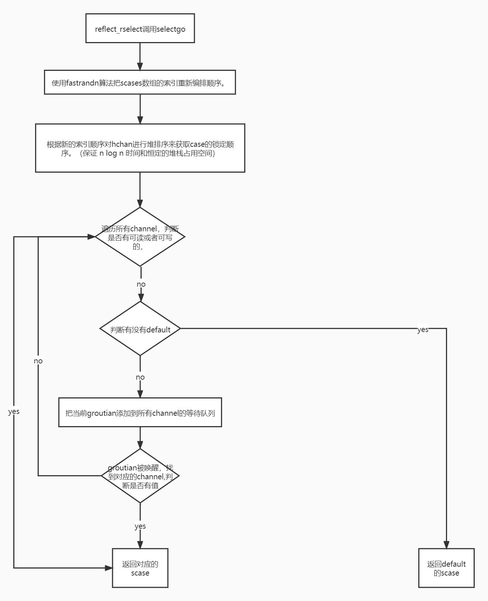

# select

- Go的select语句是一种仅能用于channl发送和接收消息的专用语句，此语句运行期间是阻塞的；当select中没有case语句的时候，会阻塞当前groutine。
- select是Golang在语言层面提供的I/O多路复用的机制，其专门用来检测多个channel是否准备完毕：可读或可写。

### 用法

- 每个 case 都必须是一个通信

- 所有 channel 表达式都会被求值

- 所有被发送的表达式都会被求值

- 如果任意某个通信可以进行，它就执行，其他被忽略。

- 如果有多个 case 都可以运行，Select 会随机公平地选出一个执行。其他不会执行。

	否则：

	1. 如果有 default 子句，则执行该语句。
	2. 如果没有 default 子句，select 将阻塞，直到某个通信可以运行；Go 不会重新对 channel 或值进行求值。

- `select{}`永远阻塞当前 Goroutine。

### 源码学习(1.17.1)

#### 数据结构

- select中case

	```go
	type scase struct {
		c    *hchan         // channel
		elem unsafe.Pointer // 发送或者接受数据的变量地址
	}
	```

- runtimeSelect 是传递给 rselect 的单个 case

	```go
	// 它必须匹配 ../reflect/value.go:/runtimeSelect
	type runtimeSelect struct {
		dir selectDir		//通信方向
		typ unsafe.Pointer // channel type (not used here)
		ch  *hchan         // channel
		val unsafe.Pointer // ptr to data (SendDir) or ptr to receive buffer (RecvDir)
	}
	```

- select case 的通信方向

	```go
	type selectDir int
	
	const (
		_             selectDir = iota
		selectSend              // 发送 case Chan <- Send
		selectRecv              // 接收 case <-Chan:
		selectDefault           // 默认 default
	)
	```

#### 运行时

执行代码流程：

1. `go/src/reflect/value.go rselect` 
2. `go/src/runtime/select.go reflect_rselect` 
3. `go/src/runtime/select.go reflectgo`

##### reflect_rselect

```go
//rselect 运行一个select。
//它返回所选case的索引。
//如果 case 是接收，则 val 将填充接收到的值。
//传统的 OK bool 指示接收是否对应于发送的值。
//go:noescape
func rselect([]runtimeSelect) (chosen int, recvOK bool)

//go:linkname reflect_rselect reflect.rselect
func reflect_rselect(cases []runtimeSelect) (int, bool) {
    //select中case数量为0时 block会调用gopark使当前goroutine陷入永久阻塞状态。
	if len(cases) == 0 {
		block()
	}
	sel := make([]scase, len(cases))
	orig := make([]int, len(cases))
	nsends, nrecvs := 0, 0
	dflt := -1
    // 遍历 cases 数组
    // 若 case 为 default，将当前 case的索引赋值给 dflt,跳出当前case,执行下一个case
    // 若 case 用于发送通道， 将当前case的信息放入上面定义的sel scase数组中，orig 存放 cases的索引信息(从前往后)
    // 若 case 用于接收通道， 将当前case的信息放入上面定义的sel scase数组中，orig 存放 cases的索引信息(从后往前)
	for i, rc := range cases {
		var j int
		switch rc.dir {
		case selectDefault:
			dflt = i
			continue
		case selectSend:
			j = nsends
			nsends++
		case selectRecv:
			nrecvs++
			j = len(cases) - nrecvs
		}

		sel[j] = scase{c: rc.ch, elem: rc.val}
		orig[j] = i
	}

	// 只有一个default时返回default的索引
	if nsends+nrecvs == 0 {
		return dflt, false
	}

	// 压缩sel和orig切片，去除多余部分（初始化时的切片长度可能包含了default的部分，但是default的数据不会被放到sel、orig中，	   // 因此中间部分会存在一个为空的case 和 0的索引）
	if nsends+nrecvs < len(cases) {
		copy(sel[nsends:], sel[len(cases)-nrecvs:])
		copy(orig[nsends:], orig[len(cases)-nrecvs:])
	}

	order := make([]uint16, 2*(nsends+nrecvs))
	var pc0 *uintptr
    // 竞争检测
	if raceenabled {
		pcs := make([]uintptr, nsends+nrecvs)
		for i := range pcs {
			selectsetpc(&pcs[i])
		}
		pc0 = &pcs[0]
	}

	chosen, recvOK := selectgo(&sel[0], &order[0], pc0, nsends, nrecvs, dflt == -1)

	// Translate chosen back to caller's ordering.
	if chosen < 0 {
		chosen = dflt
	} else {
		chosen = orig[chosen]
	}
	return chosen, recvOK
}

// go/src/runtime/select.go
func block() {
	gopark(nil, nil, waitReasonSelectNoCases, traceEvGoStop, 1) // forever
}
```

##### selectgo

selectgo函数内部逻辑：

1. 使用fastrandn算法把scases数组的索引重新编排顺序。
2. 根据新的索引顺序对hchan进行堆排序来获取case的锁定顺序。（保证 n log n 时间和恒定的堆栈占用空间）
3. 锁定所有channel。

4. 遍历所有channel，判断是否有可读或者可写的，如果有，解锁channel,返回对应数据。
5. 否则，判断有没有default，如果有，解锁channel，返回default对应scase。
6. 否则，把当前groutian添加到所有channel的等待队列里，解锁所有channel，等待被唤醒。
7. 被唤醒后，再次锁定所有channel
8. 遍历所有channel，把g从channel等待队列中移除，并找到可操作的channel
9. 如果对应的scase不为空，直接返回对应的值
10. 否则循环此过程



源码解析：

```go
// selectgo 实现了 select 语句。
// cas0 指向类型为 [ncases]scase 的数组，而 order0 指向类型为 [2*ncases]uint16 的数组，
// 其中 ncases 必须 <= 65536。两者都驻留在 goroutine 的堆栈中（不管 selectgo 中的任何转义）。
// 对于竞争检测器构建，pc0 指向 [ncases]uintptr 类型的数组（也在堆栈中）； 对于其他版本，它设置为 nil。
// selectgo 返回所选 scase 的索引，该索引与其各自的 select{recv,send,default} 调用的序号位置相匹配。
// 此外，如果选择的 scase 是接收操作，它会报告是否接收到值。
func selectgo(cas0 *scase, order0 *uint16, pc0 *uintptr, nsends, nrecvs int, block bool) (int, bool) {
	if debugSelect {
		print("select: cas0=", cas0, "\n")
	}

    // 将case的首地址指针转义为切片指针
	// 注意：为了保持精简的堆栈大小，scases 的数量上限为 65536。
	cas1 := (*[1 << 16]scase)(unsafe.Pointer(cas0))
	order1 := (*[1 << 17]uint16)(unsafe.Pointer(order0))

	ncases := nsends + nrecvs
	scases := cas1[:ncases:ncases]
	pollorder := order1[:ncases:ncases]
	lockorder := order1[ncases:][:ncases:ncases]
    
	// 注意：编译器没有对 pollorder/lockorder 的底层数组进行零初始化。
    // 即使raceenabled 为true，在没有-race 的情况下编译的包中也可能有select 语句
    //（例如runtime/signal_unix.go 中的ensureSigM）。
	var pcs []uintptr
	if raceenabled && pc0 != nil {
		pc1 := (*[1 << 16]uintptr)(unsafe.Pointer(pc0))
		pcs = pc1[:ncases:ncases]
	}
	casePC := func(casi int) uintptr {
		if pcs == nil {
			return 0
		}
		return pcs[casi]
	}

	var t0 int64
	if blockprofilerate > 0 {
		t0 = cputicks()
	}
    

	// 生成排列顺序
    // 使用fastrandn随机算法，设置pollorder数组，后面会根据这个数组进行循环，以达到随机case
	norder := 0
	for i := range scases {
		cas := &scases[i]

		// 从轮询和锁定订单中忽略没有channel的情况。
		if cas.c == nil {
			cas.elem = nil // allow GC
			continue
		}

		j := fastrandn(uint32(norder + 1))
		pollorder[norder] = pollorder[j]
		pollorder[j] = uint16(i)
		norder++
	}
	pollorder = pollorder[:norder]
	lockorder = lockorder[:norder]

	// 按 Hchan 地址对 case 进行排序以获取锁定顺序。
	// 简单的堆排序，以保证 n log n 时间和恒定的堆栈占用空间。
    // 防止不同顺序的case进来时锁定channel导致死锁。
	for i := range lockorder {
		j := i
		// Start with the pollorder to permute cases on the same channel.
		c := scases[pollorder[i]].c
		for j > 0 && scases[lockorder[(j-1)/2]].c.sortkey() < c.sortkey() {
			k := (j - 1) / 2
			lockorder[j] = lockorder[k]
			j = k
		}
		lockorder[j] = pollorder[i]
	}
	for i := len(lockorder) - 1; i >= 0; i-- {
		o := lockorder[i]
		c := scases[o].c
		lockorder[i] = lockorder[0]
		j := 0
		for {
			k := j*2 + 1
			if k >= i {
				break
			}
			if k+1 < i && scases[lockorder[k]].c.sortkey() < scases[lockorder[k+1]].c.sortkey() {
				k++
			}
			if c.sortkey() < scases[lockorder[k]].c.sortkey() {
				lockorder[j] = lockorder[k]
				j = k
				continue
			}
			break
		}
		lockorder[j] = o
	}

	if debugSelect {
		for i := 0; i+1 < len(lockorder); i++ {
			if scases[lockorder[i]].c.sortkey() > scases[lockorder[i+1]].c.sortkey() {
				print("i=", i, " x=", lockorder[i], " y=", lockorder[i+1], "\n")
				throw("select: broken sort")
			}
		}
	}

	// 锁定 select 中涉及的所有 channel
	sellock(scases, lockorder)

	var (
		gp     *g
		sg     *sudog
		c      *hchan
		k      *scase
		sglist *sudog
		sgnext *sudog
		qp     unsafe.Pointer
		nextp  **sudog
	)

	// pass 1 - 寻找已经在等待的东西
	var casi int
	var cas *scase
	var caseSuccess bool
	var caseReleaseTime int64 = -1
	var recvOK bool
    
    //根据索引遍历scases数组中的元素 
	for _, casei := range pollorder {
		casi = int(casei)
		cas = &scases[casi]
		c = cas.c
		
        //接收scase的索引
		if casi >= nsends {
             //从channel的发送队列中获取sudog，如果有，跳到recv代码块
			sg = c.sendq.dequeue()
			if sg != nil {
				goto recv
			}
            //判断channel是否为带缓冲的，并且缓冲区有值，跳到bufrecv代码块
			if c.qcount > 0 {
				goto bufrecv
			}
             //如果channel已经关闭，跳到rclose代码块
			if c.closed != 0 {
				goto rclose
			}
		} else {	//发送scase的索引
            //开启竞争时
			if raceenabled {
				racereadpc(c.raceaddr(), casePC(casi), chansendpc)
			}
            //如果channel已经关闭，跳到sclose代码块
			if c.closed != 0 {
				goto sclose
			}
            //如果channel的读取队列里存在groutian,跳到send代码块
			sg = c.recvq.dequeue()
			if sg != nil {
				goto send
			}
             //如果channel为缓冲型，并且数据没满，跳转到bufsend代码块
			if c.qcount < c.dataqsiz {
				goto bufsend
			}
		}
	}

    // 代码能走到这里，说明所有的channel都不具备读取的时机，判断是否有default
    // 如果 select 中有 default 时，解锁所有channel，跳转到 retc 代码块
	if !block {
		selunlock(scases, lockorder)
		casi = -1
		goto retc
	}

	// pass 2 - 所有 chan 入队列
	gp = getg()
	if gp.waiting != nil {
		throw("gp.waiting != nil")
	}
    
    // 循环scases，把groutian存储到channel对应的读写队列中
    // 设置gp.waiting为sudog队列
	nextp = &gp.waiting
	for _, casei := range lockorder {
		casi = int(casei)
		cas = &scases[casi]
		c = cas.c
        //构建sudog
		sg := acquireSudog()
		sg.g = gp
		sg.isSelect = true
		// No stack splits between assigning elem and enqueuing
		// sg on gp.waiting where copystack can find it.
		sg.elem = cas.elem
		sg.releasetime = 0
		if t0 != 0 {
			sg.releasetime = -1
		}
		sg.c = c
		// 按锁顺序构造等待列表。
		*nextp = sg
		nextp = &sg.waitlink
		// 发送scase的索引
		if casi < nsends {
			c.sendq.enqueue(sg)
		} else {	// 接收scase的索引
			c.recvq.enqueue(sg)
		}
	}

	// 等待被唤醒
	gp.param = nil
	// 向任何试图缩小我们的筹码量的人发出信号，告知我们即将停在一个通道上。
	// 这个 G 的状态改变和我们设置 gp.activeStackChans 之间的窗口对于堆栈收缩是不安全的。
    // //挂起goroutian，selparkcommit会给所有channel解锁
	atomic.Store8(&gp.parkingOnChan, 1)
	gopark(selparkcommit, nil, waitReasonSelect, traceEvGoBlockSelect, 1)
	gp.activeStackChans = false

    //唤醒后先给channel加锁
	sellock(scases, lockorder)

	gp.selectDone = 0
	sg = (*sudog)(gp.param)
	gp.param = nil

	// pass 3 - 从不成功的 chan 中出队，否则它们会堆积在安静的通道上，记录成功的案例（如果有）。
	// 我们按锁定顺序单独连接了 SudoG。
	casi = -1
	cas = nil
	caseSuccess = false
    // sglist为所有sudog链表
	sglist = gp.waiting
	// 在从 gp.waiting 取消链接之前清除所有 elem。
	for sg1 := gp.waiting; sg1 != nil; sg1 = sg1.waitlink {
		sg1.isSelect = false
		sg1.elem = nil
		sg1.c = nil
	}
	gp.waiting = nil

    // 循环所有case
	for _, casei := range lockorder {
		k = &scases[casei]
		if sg == sglist {
			// sg 已经被唤醒我们的 G 出列了。
			casi = int(casei)
			cas = k
			caseSuccess = sglist.success
			if sglist.releasetime > 0 {
				caseReleaseTime = sglist.releasetime
			}
		} else {
			c = k.c
			if int(casei) < nsends {
				c.sendq.dequeueSudoG(sglist)
			} else {
				c.recvq.dequeueSudoG(sglist)
			}
		}
		sgnext = sglist.waitlink
		sglist.waitlink = nil
		releaseSudog(sglist)
		sglist = sgnext
	}

	if cas == nil {
		throw("selectgo: bad wakeup")
	}

	c = cas.c

	if debugSelect {
		print("wait-return: cas0=", cas0, " c=", c, " cas=", cas, " send=", casi < nsends, "\n")
	}

	if casi < nsends {
		if !caseSuccess {
			goto sclose
		}
	} else {
		recvOK = caseSuccess
	}

	if raceenabled {
		if casi < nsends {
			raceReadObjectPC(c.elemtype, cas.elem, casePC(casi), chansendpc)
		} else if cas.elem != nil {
			raceWriteObjectPC(c.elemtype, cas.elem, casePC(casi), chanrecvpc)
		}
	}
	if msanenabled {
		if casi < nsends {
			msanread(cas.elem, c.elemtype.size)
		} else if cas.elem != nil {
			msanwrite(cas.elem, c.elemtype.size)
		}
	}

    // 继续锁定channel
	selunlock(scases, lockorder)
    //跳转到retc代码块
	goto retc
// channel的缓冲区有数据时，直接从缓冲区获取数据
bufrecv:
	if raceenabled {
		if cas.elem != nil {
			raceWriteObjectPC(c.elemtype, cas.elem, casePC(casi), chanrecvpc)
		}
		racenotify(c, c.recvx, nil)
	}
	if msanenabled && cas.elem != nil {
		msanwrite(cas.elem, c.elemtype.size)
	}
	recvOK = true
	qp = chanbuf(c, c.recvx)
    //如果有接收值，把数据地址存入elem中
	if cas.elem != nil {
		typedmemmove(c.elemtype, cas.elem, qp)
	}
	typedmemclr(c.elemtype, qp)
    //接收索引往后挪一位或者初始化为0
	c.recvx++
	if c.recvx == c.dataqsiz {
		c.recvx = 0
	}
    //缓冲区的数据量减少一个
	c.qcount--
    //解锁所有channel
	selunlock(scases, lockorder)
    //跳转到retc代码块
	goto retc

//channel的缓冲区有空闲位置时，把数据直接写入buffer中
bufsend:
	if raceenabled {
		racenotify(c, c.sendx, nil)
		raceReadObjectPC(c.elemtype, cas.elem, casePC(casi), chansendpc)
	}
	if msanenabled {
		msanread(cas.elem, c.elemtype.size)
	}
    //设置数据到缓冲区
	typedmemmove(c.elemtype, chanbuf(c, c.sendx), cas.elem)
    
    //发送下标向后挪动或者初始化为0
	c.sendx++
	if c.sendx == c.dataqsiz {
		c.sendx = 0
	}
    //缓冲区中数据量加1
	c.qcount++
    //解锁channel
	selunlock(scases, lockorder)
    //跳转到retc代码区
	goto retc

recv:
	// 从发送的sudog中获取数据
    // 解锁channel
    // 唤醒goroutian
	recv(c, sg, cas.elem, func() { selunlock(scases, lockorder) }, 2)
	if debugSelect {
		print("syncrecv: cas0=", cas0, " c=", c, "\n")
	}
	recvOK = true
	goto retc
    
//接收时channel已关闭
rclose:
	// read at end of closed channel
    // 解锁channel
	selunlock(scases, lockorder)
	recvOK = false
    // 如果有有接收值， eg： case a := <- chan0,把数据地址赋值给elem
	if cas.elem != nil {
		typedmemclr(c.elemtype, cas.elem)
	}
	if raceenabled {
		raceacquire(c.raceaddr())
	}
	goto retc

//发送时channel中存在接收goroutian
send:
	// can send to a sleeping receiver (sg)
	if raceenabled {
		raceReadObjectPC(c.elemtype, cas.elem, casePC(casi), chansendpc)
	}
	if msanenabled {
		msanread(cas.elem, c.elemtype.size)
	}
    //把数据发送到接收的goroutian中
    //解锁channel
    //唤醒goroutian
	send(c, sg, cas.elem, func() { selunlock(scases, lockorder) }, 2)
	if debugSelect {
		print("syncsend: cas0=", cas0, " c=", c, "\n")
	}
	goto retc
    
//返回
retc:
	if caseReleaseTime > 0 {
		blockevent(caseReleaseTime-t0, 1)
	}
     //返回对应case的下标，如果是接收，返回recvOK,channel关闭时为false
	return casi, recvOK
    
//发送时channel已关闭，解锁channel，直接panic
sclose:
	// send on closed channel
	selunlock(scases, lockorder)
	panic(plainError("send on closed channel"))
}

```

##### recv接收方法

```go
// recv 在全通道 c 上处理接收操作。
// 有两部分：
// 1) 发送者 sg 发送的值被放入通道中，发送者被唤醒继续其快乐的方式。
// 2) 接收者接收到的值（当前G）写入ep。
// 对于同步通道，两个值相同。
// 对于异步通道，接收方从通道缓冲区获取数据，发送方的数据放入通道缓冲区。
// 通道 c 必须已满并已锁定。 recv 使用 unlockf 解锁 c。 sg 必须已经从 c 出列。
// 非 nil ep 必须指向堆或调用者的堆栈。
func recv(c *hchan, sg *sudog, ep unsafe.Pointer, unlockf func(), skip int) {
    //如果为非缓冲区
	if c.dataqsiz == 0 {
		if raceenabled {
			racesync(c, sg)
		}
		if ep != nil {
			// 从sender队列中直接复制数据
			recvDirect(c.elemtype, sg, ep)
		}
	} else {
        // 队列已满。 获取队列头部的项目。 
        // 使发件人将其项目排在队列的尾部。 
        // 由于队列已满，它们都是同一个槽。
		qp := chanbuf(c, c.recvx)
		if raceenabled {
			racenotify(c, c.recvx, nil)
			racenotify(c, c.recvx, sg)
		}
		//如果接受变量不为空，符合数据到ep
		if ep != nil {
			typedmemmove(c.elemtype, ep, qp)
		}
		//从缓冲区复制数据
		typedmemmove(c.elemtype, qp, sg.elem)
		c.recvx++
		if c.recvx == c.dataqsiz {
			c.recvx = 0
		}
		c.sendx = c.recvx // c.sendx = (c.sendx+1) % c.dataqsiz
	}
	sg.elem = nil
	gp := sg.g
    //解锁channel
	unlockf()
    //发送者的param设置
	gp.param = unsafe.Pointer(sg)
	sg.success = true
	if sg.releasetime != 0 {
		sg.releasetime = cputicks()
	}
    //唤醒goroutine
	goready(gp, skip+1)
}
```

##### send方法：

```go
// send 处理空通道上的发送操作 c.
// 发送者发送的值 ep 被复制到接收者 sg。
// 然后接收器被唤醒，继续它的快乐之路。
// 通道 c 必须为空且已锁定。 使用 unlockf 发送解锁 c。
// sg 必须已经从 c 中出列。
// ep 必须非 nil 并指向堆或调用者的堆栈。
func send(c *hchan, sg *sudog, ep unsafe.Pointer, unlockf func(), skip int) {
	if raceenabled {
		if c.dataqsiz == 0 {
			racesync(c, sg)
		} else {
			// Pretend we go through the buffer, even though
			// we copy directly. Note that we need to increment
			// the head/tail locations only when raceenabled.
			racenotify(c, c.recvx, nil)
			racenotify(c, c.recvx, sg)
			c.recvx++
			if c.recvx == c.dataqsiz {
				c.recvx = 0
			}
			c.sendx = c.recvx // c.sendx = (c.sendx+1) % c.dataqsiz
		}
	}
	if sg.elem != nil {
		sendDirect(c.elemtype, sg, ep)
		sg.elem = nil
	}
	gp := sg.g
	unlockf()
	gp.param = unsafe.Pointer(sg)
	sg.success = true
	if sg.releasetime != 0 {
		sg.releasetime = cputicks()
	}
	goready(gp, skip+1)
}
```

##### fastrandn

```go
//go/src/runtime/stubs.go
//go:nosplit
func fastrandn(n uint32) uint32 {
	// 这类似于 fastrand() % n，但速度更快。
	// See https://lemire.me/blog/2016/06/27/a-fast-alternative-to-the-modulo-reduction/
	return uint32(uint64(fastrand()) * uint64(n) >> 32)
}
```

##### getg

```go
//go/src/runtime/stubs.go
// getg 返回指向当前 g 的指针。
// 编译器将此函数的调用重写为直接（从 TLS 或从专用寄存器）获取 g 的指令。
func getg() *g
```

##### fastrand

```go
//go/src/runtime/stubs.go
//go:nosplit
func fastrand() uint32 {
	mp := getg().m
	// Implement xorshift64+: 2 32-bit xorshift sequences added together.
	// Shift triplet [17,7,16] was calculated as indicated in Marsaglia's
	// Xorshift paper: https://www.jstatsoft.org/article/view/v008i14/xorshift.pdf
	// This generator passes the SmallCrush suite, part of TestU01 framework:
	// http://simul.iro.umontreal.ca/testu01/tu01.html
	s1, s0 := mp.fastrand[0], mp.fastrand[1]
	s1 ^= s1 << 17
	s1 = s1 ^ s0 ^ s1>>7 ^ s0>>16
	mp.fastrand[0], mp.fastrand[1] = s0, s1
	return s0 + s1
}
```

##### sellock

```go
func sellock(scases []scase, lockorder []uint16) {
	var c *hchan
	for _, o := range lockorder {
		c0 := scases[o].c
		if c0 != c {
			c = c0
			lock(&c.lock)
		}
	}
}
```

### 参考资料

[Go 语言 select 语句](https://www.runoob.com/go/go-select-statement.html)

[Go select](https://studygolang.com/articles/34559)

[Golang 深入源码 —— select 与 channel](https://blog.csdn.net/dagu131/article/details/108385060)

[[golang-select详解](https://segmentfault.com/a/1190000040274486)](https://segmentfault.com/a/1190000040274486)
